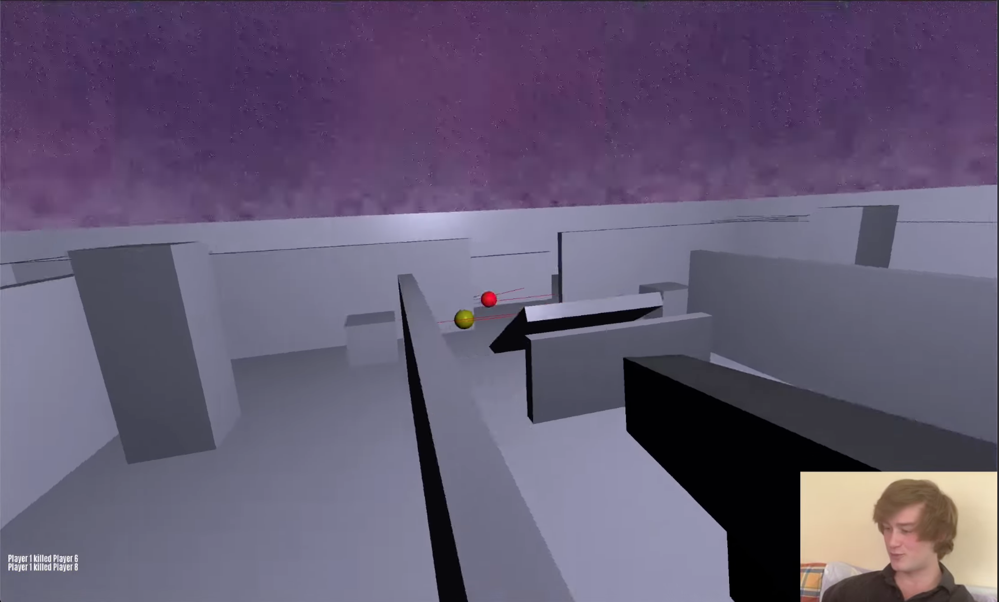

An educational project showcasing modern multiplayer networking architecture

See the demo with code explanation: https://www.youtube.com/watch?v=UC02WaOcnAQ



## Overview

The project implements a multi-client, single-server architecture, where the
game loop: poll input, update, render, is split up such that clients send inputs to the
server, with the server maintaining the full game-state, and sending snapshots back
to the clients.

```cpp
/* Single player vs Multiplayer game loop (crudely) */

/* Single Player */
void game_loop(float dt)
{
		poll_user_input();
		update(dt);
		render();
}

/* Multiplayer */
void client_game_loop(float dt)
{
		poll_user_input();
		send_user_input_to_server();
		read_server_snapshot();
		render();
}

void server_game_loop(float dt)
{
		poll_received_input();
		update(dt);
		send_snapshot();
}
```


This requires building a networking abstraction over UDP, to provide both reliable and unreliable messages, the former for important events, like player connection requests, and the latter for expendable messages, like inputs and snapshots, the loss of which can be smoothed over.

Reliable messaging without TCP is achieved by taking advantage of the constant bi-directional traffic between clients and server; ACKs are encoded in a header on all messages, such that a reliable 'Player Killed' message sent to clients, can be ACK'd by the next Input message sent by clients back to the server.

```cpp
struct PacketHeader
{
	uint8_t	 type;
	uint8_t	 flags;
	uint16_t sequence;
	uint32_t ack_bits;
	uint16_t ack;
};
```
The two other problems that need to be solved are thus:

1) Less snapshots from the server arrive than the frame rate of the game
2) Waiting for the server's response to a players input is acceptable for seeing other players, but not yourself, as the lag is not pleasant.
3) Given the solutions to the above (entity interpolation and client side prediction),  and the fact that players may have different round trip times (RTT) to the server, the server must account for the fact that players have differing views of each other.

#### Entity interpolation
To account for the fact that less snapshots, containing data like all the players
positions, arrive less frequently than what will be rendered, is fixed by opting to render the game state some time in the past relative to the servers time, and mix between received snapshots

```cpp
struct Snapshot
{
	float							 timestamp;
	fixed_array<Player, MAX_PLAYERS> players;
};

/*
 * before player 1: pos(0,0,0)
 * after  player 1: pos(0,0,1)
 * t = 0.9
 *
 * rendered player 1: pos(0,0,0.9)
 */
struct InterpolatedSnapshot
{
	Snapshot *before;
	Snapshot *after;
	float	  t;
};
	...
	for (uint32_t i = 0; i < snapshots.size() - 1; i++)
	{
			...
		if (next->timestamp >= render_time
		&& current->timestamp <= render_time)
		{
			...
```

#### Client-Side prediction

The RTT, time between server snapshots, and render_time delay aggregate to give the time that it takes for a player to apply some input and for it to manifest on the screen, perhaps being upwards of 150ms in normal conditions, which is surprisingly unbearable as I found out.

Client and Server can share code that is used to update the game state, like apply_input(PlayerInput), and apply_physics(PlayerState). Each input message from the client has an incrementing sequence number. When it sends an input to the server, it stores it, and immediately applies it with the shared update functions to the local player (predicting where the player will be according to the server).

Each snapshot message for each player contains the sequence number of the last input it has received, such that on reception, clients can the players input as the servers, and reapply the last N snapshots it has stored, but the server has not yet processed, under normal conditions, the player should be in the same position that they were before the snapshot and reconciliation process occurred.

```cpp
/* Client code ran every frame */
void
apply_input(float move_x, float move_z, uint8_t buttons)
{
	SendPacket<InputMessage> input;
	...
	network_send_unreliable(&CLIENT.net, CLIENT.server_peer_id, input);

	CLIENT.input_history.push(input.payload);

	apply_player_input(&CLIENT.local_player, &input.payload, TICK_TIME);
	apply_player_physics(&CLIENT.local_player, CLIENT.map,
	CLIENT.snapshots.end().data->players, TICK_TIME);
}

/* Client code ran on snapshot reception */
void
process_snapshot(SnapshotMessage *snap)
{ ...
	glm::vec3 predicted_position = CLIENT.local_player.position;
	Player	  corrected_state = *local;
	for (uint32_t i = 0; i < CLIENT.input_history.size(); i++)
	{
		InputMessage *input = CLIENT.input_history.at(i);

		if (input->sequence_num > local->last_processed_seq)
		{
			apply_player_input(&corrected_state, input, TICK_TIME);
			apply_player_physics(&corrected_state, CLIENT.map,
			CLIENT.snapshots.end().data->players, TICK_TIME);
			replayed++;
		}
	}
	CLIENT.local_player = corrected_state;
	float error = glm::length(predicted_position -
	corrected_state.position);


/* Server update code */
...
while (client->input_buffer.size())
{
	auto input = client->input_buffer.pop();

	if (input->sequence_num <= client->last_processed)
	{
			continue;
	}

	client->last_processed = input->sequence_num;
	...
	apply_player_input(entity, input, dt);
	apply_player_physics(entity, SERVER.map,
	SERVER.frame.players, dt);
}

```
#### Lag compensation
Clients having different RTT's from the server requires each player has a slightly different render time from each other, which effects the players actions, like where and when to shoot at an enemy.
To make the game fair, the result of a shot is not tested against the most recent position of a player, but their historical position, as per when the shot was taken.
Each input message has a time stamp, such that the server can retrieve the positions of players closest to that timestamp and hit test against them.
This feature is the reason for the 'How did they hit me I was behind a wall' that we have all likely bemoaned on at least one occasion.

```cpp
void
perform_lag_compensated_shot(Player *shooter,
int8_t shooter_idx, float shot_time)
{
	Snapshot *historical;
	if (!get_frame_at_time(shot_time, &historical))
	{
		historical = &SERVER.frame;
	}
	...
	Player *historical_shooter = &historical->players[shooter_idx];
	...
	Shot	  shot = create_shot(historical_shooter);
	...
```
#### NPCs
No friends were willing to help me test this project, so I wrote some new friends (ai.cpp). The demo shown in the video shows NPCs, each a client implemented with a basic Wander, Engage, Retreat state machine, using spatial data derived from the shared map, sending and receiving packets just like a user controlled client.


## Implementation Notes

This is project is first and foremost educational, designed to showcase a specific architecture and making simplifications wherever else that end is not served.

Open-source libraries and projects can act as educational resources, but the 'core-concepts' are harder to parse due to their sheer size, the bulk of which is used for production concerns like security, extensibility, backwards compatibility, defensive programming, etc, that, while interesting and informative in and of themselves, are only noise when trying to understand a specific element.

Feature-wise, I've chosen to not add assets, sound, and other features that would make it an actual 'game', like a scoreboard.

Code-wise, I've attempted to keep server/client.cpp files clear of detail that is unrelated to the networking. Both have client/server_extended.hpp files for things like camera and ui updates, and shot tracing respectively.

client/server states are implemented as a single static structs, which, while theoretically limiting testability, extensibility, etc, makes the file less noisy, and easier to parse the core-concepts on display.

Designing a project for pedagogical purposes is difficult because you can't experience it as someone with no knowledge of it. For this reason please feel free to contact me via email with any suggestions!


## Prerequisites

Install the required dependencies for your platform:

**Linux (Ubuntu/Debian):**

bash

```bash
sudo apt-get install cmake libglfw3-dev libfreetype-dev libgl1-mesa-dev
```

**macOS:**

bash

```bash
brew install cmake glfw freetype
```

**Windows:**

-   Install [CMake](https://cmake.org/download/)
-   Download [GLFW](https://www.glfw.org/download.html) and install to `C:\Program Files\GLFW`
-   Install FreeType (via vcpkg or manual download)

## Building

bash

```bash
# Create build directory
mkdir build
cd build

# Configure (Release build)
cmake ..

# Or configure for Debug build
cmake -DCMAKE_BUILD_TYPE=Debug ..

# Build
cmake --build .
```

## Running

bash

```bash
# From build directory
./COD        # Linux/macOS
COD.exe      # Windows

./COD server # Runs server on port 7777
./COD npcs 10 # Creates min(10, MAX_PLAYERS) npcs
./COD 8000    # Runs client on port 8000
```

## Project Structure

-   `src/` - Application source files (.cpp)
-   `lib/` - Third-party library source files (.c)

## Build Configuration

-   **C++ Standard:** C++17
-   **Debug flags:** `-g -O0 -DDEBUG` (GCC/Clang) or `/Zi /Od /DDEBUG` (MSVC)
